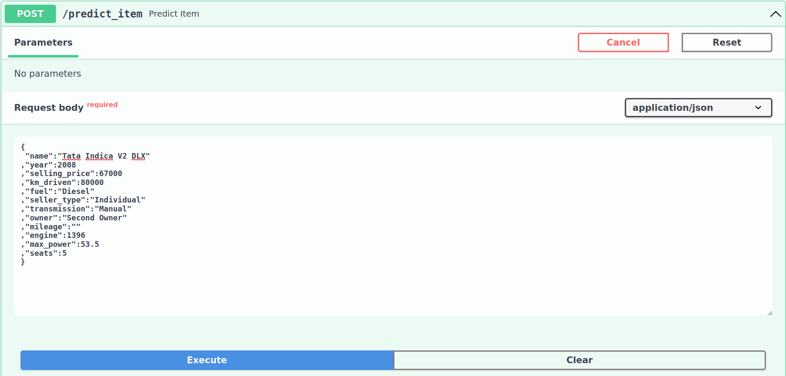
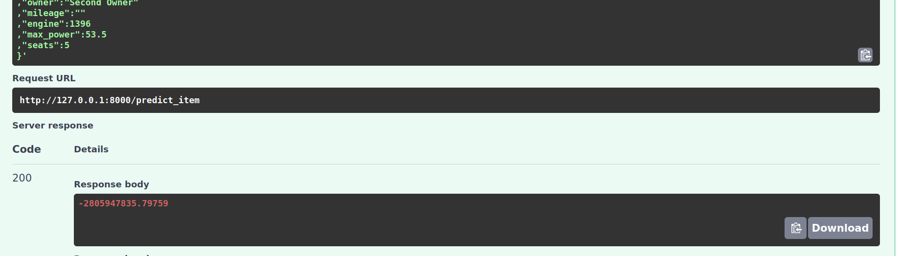
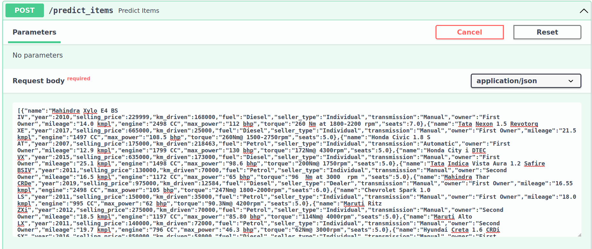
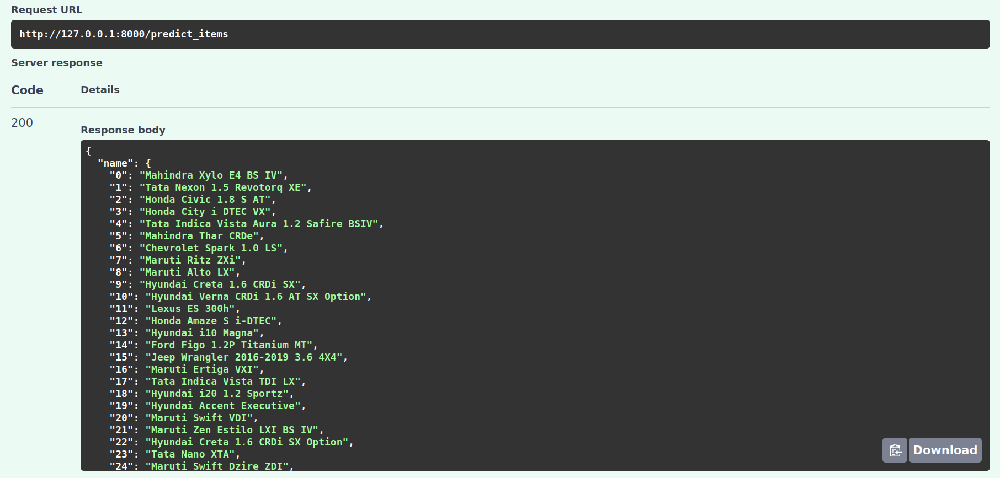
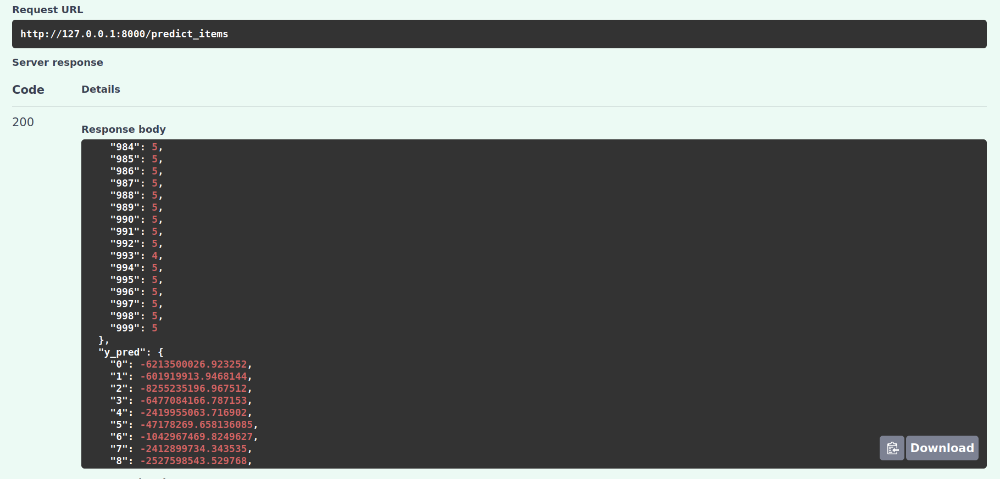

# Выводы:
## 1) Что было сделано?
1.1) Был проведён EDA, а именно:
- первичный просмотр датафрейма и его характеристик
- анализ наличия пропусков в столбцах
- очищение дф от дубликатов
- исключение единиц измерения из столбцов (либо удаление таких столбцов)
- были построены попарные распределения числовых признаков для трейна и теста, произведен визуальный анализ схожести распределений, выдвинуты гипотезы
- была построена матрица корреляций и тепловая карта для оценки корреляции признаков между собой
- были изучены основные корреляции между признаками и таргетом, и просто между признаками
- дополнительно были построены попарные распределения без выбросов для трёх пар признаков, посчитаны коэфф. корреляции
1.2) Были построены и проанализированы простые линейные модели только на вещественных признаках, а именно:
- была обучена модель линейной регрессии с дефолтными параметрами без стандартизации признаков, были посчитаны метрики качества предсказаний R2 и MSE для тренировочного и тестового датасетов
- аналогичным образом была обучена линейная регрессия со стандартизированными признаками, изучены информативности весов
- была обучена сначала L1 регрессия на дефолтных параметрах, а впоследствии на подобранных по GridSearch, были изучены занулившиеся веса
- аналогичным образом была обучена ElasticNet регрессия
1.3) Были добавлены категориальные признаки:
- для кодирования использовался OneHot
- был подобран параметр регуляризации для Ridge-регрессии
- была обучена Ridge-регрессия на вещественных и категориальных признаках
## 2) С какими результатами?
Итого в рамках первых трёх пунктов был проведён разведочный анализ данных с препроцессингом,
были исследованы и сравнены между собой линейные модели, был произведен подбор параметров, была выбрана лучшая модель -
ей оказалась Ridge-регрессия с alpha = 506 и метрикой R2:
- на трейне: R2 = 0.618103
- на тесте: R2 = 0.617023
- mse_train: 1.094663e+11
- mse_test:  2.514534e+11
(
лучшие модели L1 и ElasticNet имеют следующие результаты:

-   L1 optimal
        r2_train     0.582581
        r2_test      0.564508
        mse_train    1.196483e+11
        mse_test     2.503334e+11

-   Elnet optimal
        r2_train    0.584942
        r2_test     0.562559
        mse_train    1.189717e+11
        mse_test     2.514534e+11
)
1.4) Была посчитана бизнес-метрика - доля предсказаний, отличающихся от реальных цен не более, чем на 10%.
- Эта метрика оказалась равна prop = 22.7 %
## 4) Что сделать не вышло?
1.5) Был реализован сервис на FastAPI, который способен принимать на вход как единичные объекты
в виде json-файла, и выдавать для них предикты, так и массивы объектов с выдачей предиктов для них
Правда, сдаётся мне, я где-то косякнул в реализации FastAPI, поэтому предикты там у меня отличаются от предиктов
в ноутбуке - это из того, что не получилось... Доделывать я это не стал только потому что дедлайны пылают ярчайшим
пламенем, время 5:34 и я очень устал, но если что я знаю, что там проблема, скорее всего она со склейкой датафреймов

## 4) Что дало наибольший буст в качестве?
1.6) Наибольший буст в качестве дал последовательный гридсёрч, построенный по методу бинарного поиска
Сохранять результаты его я не стал, потому что в ноутбуке и так бардак, но суть в том, что на каждую модель я гридсёрчил
минимум два, максимум 4 раза, чтобы найти тот диапазон, где метрика достигает максимума

А ещё добавление категориальных фич очень хорошо повлияло на скор
По поводу логики кода - местами он будет длинноцепочечный и не очень красивый, но у этого есть обоснование - я опирался на
то, что нам не стоит мусорить в память слишком много, поэтому длинные цепочки преобразований с pandas-объектами - это очень
даже осознанная штука
Я постарался разбить эти цепочки на несколько строк там, где совсем всё плохо, вот

Скрины работы FastAPI:

predict_item():

predict_items():

